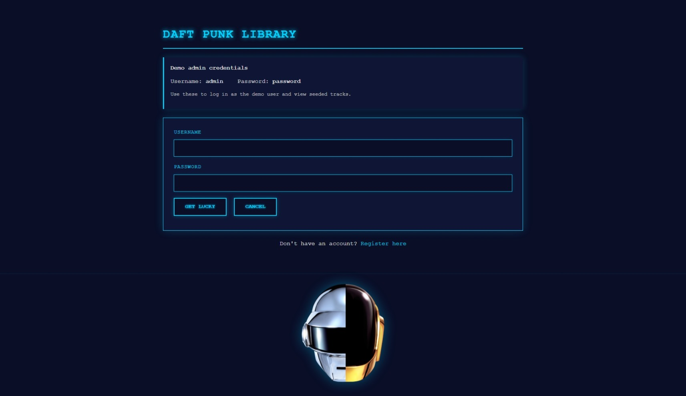
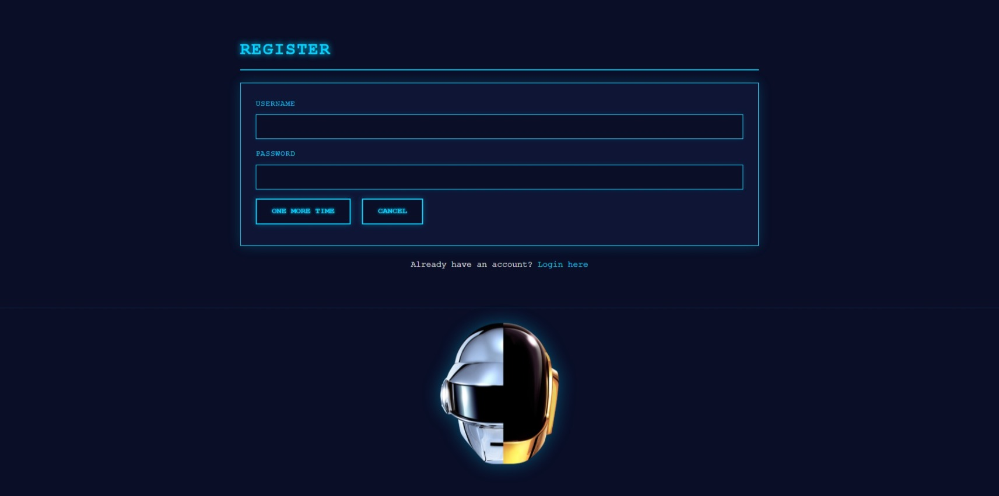
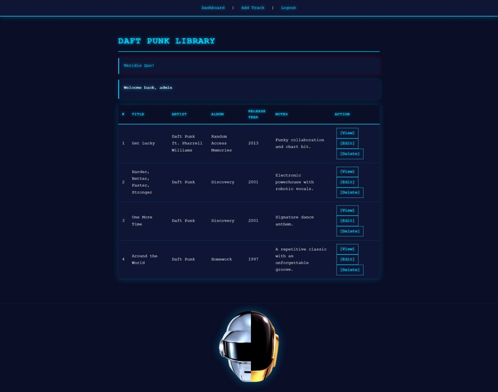
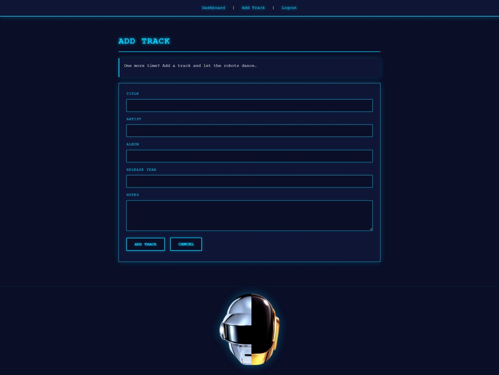
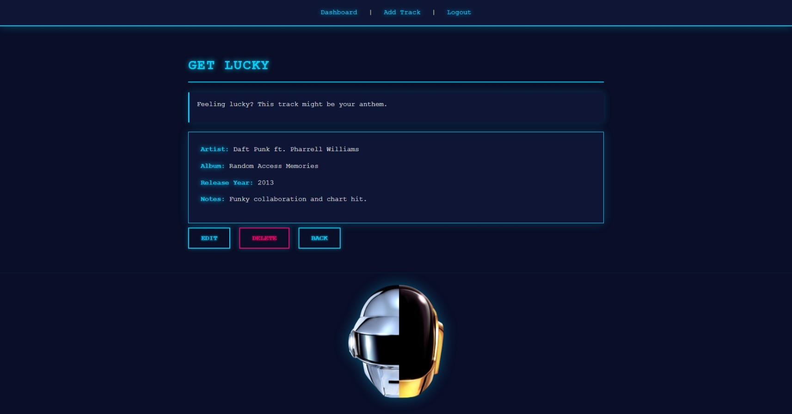

# PHP Mini Project: Daft Punk Library

This project is a native PHP web application for managing a Daft Punk track library. It demonstrates real-world web development skills: PDO database access, OOP design, session management, and a user-friendly cyberpunk-themed interface.

## Features

- **Complete CRUD System**: Create, read, update, and delete tracks
- **User Authentication**: Registration, login, logout with session management
- **Cyberpunk UI**: Dark theme with neon styling and Daft Punk imagery
- **Daft Punk Easter Eggs**: Themed messages throughout the app ("Veridis Quo!", "Short Circuit!", "Human After All")
- **Security**: PDO prepared statements for all database queries; user data isolation

## What the App Does

A user can:

- register a new account
- log in and log out
- add a track
- read a list of tracks
- view one track
- edit a track
- delete a track

Each track belongs to one logged-in user.

## Project Structure

```
php_project/
├── index.php                 # Entry point; redirects to public/
├── app/
│   ├── Db.php              # PDO database connection singleton
│   ├── Users.php           # Authentication (register, login, logout)
│   └── Tracks.php          # Track CRUD operations and model
├── public/
│   ├── index.php           # App gateway (redirects to login/dashboard)
│   ├── login.php           # Login page with demo credentials
│   ├── register.php        # Registration form
│   ├── dashboard.php       # User's track list (read)
│   ├── add_track.php       # Add track form (create)
│   ├── edit_track.php      # Edit track form (update)
│   ├── track_view.php      # View single track detail
│   ├── delete_track.php    # Delete track (delete)
│   ├── logout.php          # Logout handler
│   ├── *_action.php        # Form action handlers
│   ├── style.css           # Cyberpunk neon theme
│   ├── menu.php            # Navigation bar include
│   └── partials/
│       └── footer.php      # Shared footer with Daft Punk image
├── sql/
│   ├── schema.sql          # Database and table creation
│   └── seed.sql            # Demo user and sample tracks
└── README.md               # This file
```

## How to Run It

### 1. Install PHP and MySQL

You need:

- PHP 8.x
- MySQL or MariaDB
- XAMPP or another local server stack

### 2. Put the Folder in Your Web Root

Place the `php_project` folder inside your server folder.

Example with XAMPP:

- `htdocs/php_project`

### 3. Create the Database

Open MySQL and run the SQL files in this order:

1. `sql/schema.sql`
2. `sql/seed.sql`

This creates the database, tables, demo user, and sample tracks.

### 4. Open the App

Go to one of these URLs in your browser:

- `http://localhost/php_project/`
- `http://localhost/php_project/public/`

The root `index.php` forwards into the app automatically.

### 5. Test the Demo Login

The demo credentials are displayed on the login page for easy reference:

- **Username:** `admin`
- **Password:** `password`

These credentials are pre-seeded in the database to allow graders and instructors to quickly view the app's functionality without creating a new account.

## Screenshots

### Login



### Register



### Dashboard



### Add Track



### View Track



## Project Requirements Compliance

### ✓ Authentication System

Fully implemented in `Users.php`:
- User registration with duplicate-username checking
- Secure login with session creation (`$_SESSION['username']`, `$_SESSION['user_id']`)
- Logout with `session_destroy()`
- Page redirects using `header('Location: ...')`
- Protected pages that redirect unauthenticated users to login

### ✓ CRUD Operations

All four operations implemented in `Tracks.php`:
- **Create**: `add()` — Insert new track
- **Read**: `getAllTracks()`, `getTrackById()` — Fetch tracks
- **Update**: `update()` — Modify existing track
- **Delete**: `delete()` — Remove track

User data is isolated: each user only sees their own tracks.

### ✓ Object-Oriented Programming

Three well-designed classes:
- **`Db.php`**: Singleton pattern for PDO connection management
- **`Users.php`**: Encapsulates authentication logic
- **`Tracks.php`**: Model with properties, getters, and CRUD methods

### ✓ Database (PDO + MySQL)

- PDO singleton ensures single connection
- All queries use **prepared statements** with named parameters (`:param`)
- Protects against SQL injection
- Proper schema with PRIMARY KEY, UNIQUE KEY, and foreign key relationships

### ✓ Code Organization

- **Separation of concerns**: `app/` for logic, `public/` for presentation
- **DRY principle**: Shared footer partial, reusable CSS
- **Clean HTML/CSS**: Cyberpunk theme applied consistently

### Beyond Minimum Requirements

This implementation also includes:
- Form validation and error handling
- Daft Punk-themed UI with custom CSS and branding
- Serial numbering for better UX
- Easter eggs for engagement
- Footer with Daft Punk imagery
